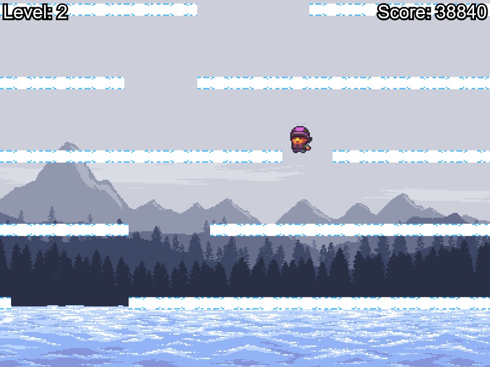

# Mountain Climber

## Overview
Mountain Climber is a simple platformer game where the goal is to stay ahead of the screen moving upwards. Falling off the bottom of the screen results in death and the level will restart. A level is completed by staying alive for 30 seconds. For each level of the game, the speed at which the screen moves increases.

## Starting the game
The game should run in any modern web browser. Run the game by opening `index.html`. Alternatively, the game is also available online at https://users.aalto.fi/~rasanet3/mountain_climber/.

## Controls
Left and right arrow keys are used for moving. Up arrow key is used for jumping. Letting go of the up arrow key results in a shorter jump.

## Graphics
The background graphic is based on work by KnoblePersona and CWL and licensed as CC-BY-SA. The character graphic is based on work by Buch. Graphics obtained from https://opengameart.org.
